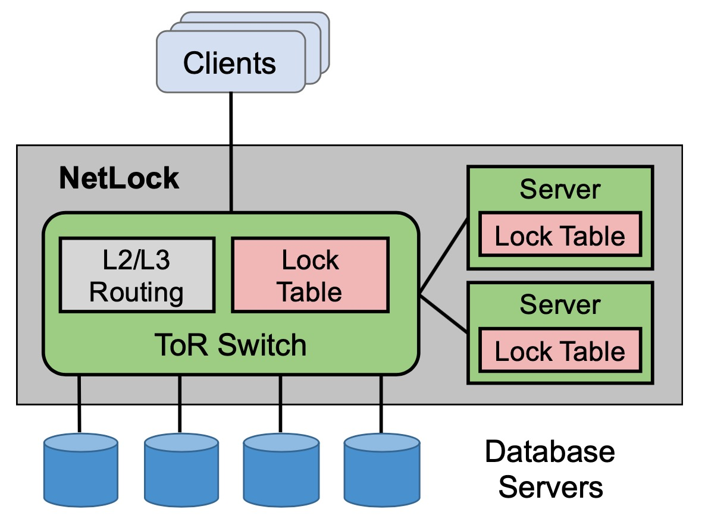
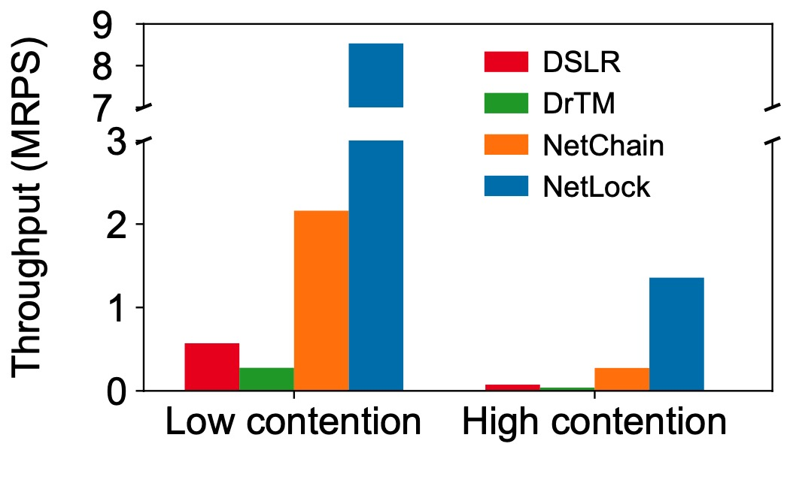

# NetLock: Fast, Centralized Lock Management Using Programmable Switches
## 0. Introduction<br>
NetLock is a new centralized lock manager that co-designs servers and network switches to achieve high performance without sacrificing flexibility in policy support. NetLock exploits the capability of emerging programmable switches to directly process lock requests in the switch data plane.



Here we show some major building blocks of NetLock and how they are the implemented at a high level.
- **Lock Request Handling**<br>
  Due to the limitation of switch memory, NetLock only processes requests on popular locks in the switch, while the lock servers will help with the rest of the locks. We use `check_lock_exist_table` in `netlock.p4` to check whether the switch is responsible for the coming packet (request).
  ```p4
  table check_lock_exist_table {
    reads {
      nlk_hdr.lock: exact;
    }
    actions {
      check_lock_exist_action;
    }
    size: NUM_LOCKS;
  }

  action check_lock_exist_action(index) {
    modify_field(meta.lock_exist, 1);
    modify_field(meta.lock_id, index);
  }
  ```
- **Switch Memory Layout**<br>
  We store the requests in a large circular queue and keep extra registers for the heads/tails/boundaries, so that each queue can have a flexible length and the switch memory can be efficiently utilized:
  - `head_register`: stores the head pointers.<br>
  - `tail_register`: stores the tail pointers.<br>
  - `left_bound_register`: stores the left boundaries.<br>
  - `right_bound_register`: stores the right boundaries.<br>
- **Resubmission**<br>
  After a lock is released, the packet will be resubmitted to check on the requests waiting in the queue.
  We store the information of dequeued request into the packet header.
  ```p4
  action mark_to_resubmit_action() {
    modify_field(nlk_hdr.recirc_flag, 1);
    add_header(recirculate_hdr);
    modify_field(recirculate_hdr.cur_tail, meta.tail);
    modify_field(recirculate_hdr.cur_head, meta.head);
    modify_field(recirculate_hdr.dequeued_mode, current_node_meta.mode);
    modify_field(meta.do_resubmit, 1);
  }
  ```
  For each packet, we check `nlk_hdr.recirc_flag`, `recirculate_hdr.dequeued_mode`, and `current_node_meta.mode` to decide whether we need to notify the clients and whether we need to resubmit this packet in the `release_lock` control block of `netlock.p4`.


More details of the design are available in our SIGCOMM'20 paper "NetLock: Fast, Centralized Lock Management Using Programmable Switches". [[Paper]](http://cs.jhu.edu/~zhuolong/papers/sigcomm20netlock.pdf)

Below we show how to configure the environment, how to run the system, and how to reproduce the results.

## 1. Content<br>
- dpdk_code/<br>
  - client_code/: C code to run on clients.<br>
  - lock_server_code/: C code to run on lock servers.<br>
- switch_code/<br>
  - netlock/
    - p4src/: data-plane module (p4 code) for NetLock.<br>
    - controller_init/: control-plane module for NetLock.<br>
  - netchain/: netchain for comparison<br>
- results/: We collect results from all the servers and store them here.<br>
- logs/: We collect logs from all the servers and store them here.<br>
- traces/: Some traces we use for the experiments.<br>
  - TPCC trace link: [Click to download!](http://cs.jhu.edu/~zhuolong/resource/tpcc_traces.zip)<br>
  - Microbenchmark trace link: [Click to download!](http://cs.jhu.edu/~zhuolong/resource/microbenchmark.zip)<br>
  - Move the zip to the corresponding folder and unzip.<br>
- console.py: A script to help run different set of evaluations.<br>
- config.py: Some parameters to configure.<br>
- parser.py: A script to parse the raw results.<br>
- README.md: This file.<br>

## 2. Environment requirement<br>
- Hardware
  - A Barefoot Tofino switch.<br>
  - Servers with a DPDK-compatible NIC (we used an Intel XL710 for 40GbE QSFP+) and multi-core CPU.<br>
- Software<br>
  The current version of NetLock is tested on:<br>
    - Tofino SDK (version after 8.2.2) on the switch.<br>
    - DPDK (16.11.1) on the servers.<br>
      You can either refer to the [official guige](https://doc.dpdk.org/guides/linux_gsg/quick_start.html) or use the tools.sh script in dpdk_code/.
        ```shell
        cd dpdk_code
        ./tools.sh install_dpdk
        ```
  We provide easy-to-use scripts to run the experiments and to analyze the results. To use the scripts, you need:
    - Python2.7, Paramiko at your endhost.<br>
      ```pip install paramiko```

## 3. How to run<br>
First the traces should be downloaded to the traces/ directory.
```shell
cd traces
wget [The link is in the Content section]
unzip tpcc_traces.zip -d tpcc_traces
unzip microbenchmark.zip -d microbenchmark
```
Then you can either manually execute programs on the switch and the servers, or use the script we provided (Recommended).
- To use scripts (Recommended)<br>
  - Configure the parameters in the files based on your environment<br>
    - `config.py`: provide the information of your servers (username, passwd, hostname, dir).<br>
    - `switch_code/netlock/controller_init/ports.json`: use the information (actual enabled ports) on your switch.
  - Environment setup<br>
    - Setup the switch<br>
      - Setup the necessary environment variables to point to the appropriate locations.<br>
      - Copy the files to the switch.<br>
        - `python console.py init_sync_switch`<br>
      - Compile the NetLock.<br>
        - `python console.py compile_switch`<br>
          This will take **a couple of minutes**. You can check `logs/p4_compile.log` in the switch to see if it's finished.
    - Setup the servers<br>
      - Setup DPDK environment (install dpdk, and set correct environment variables).<br>
      - Copy the files to the servers.<br>
        - `python console.py init_sync_server`<br>
      - Compile the clients and lock servers.<br>
        - `python console.py compile_host`<br>
          It will compile for both lock servers and clients.<br>
      - Bind NIC to DPDK.<br>
        - `python console.py setup_dpdk`<br>
          It will bind NIC to DPDK for both lock servers and clients.<br>
  - Run the programs<br>
    - Run NetLock on the switch<br>
      - `python console.py run_netlock`<br>
        It will bring up both the data-plane module and the control-plane module. It may take **up to 150 seconds** (may vary between devices). You can check `logs/run_ptf_test.log` in the switch to see if it's finished (it will say `"INIT Finished"`).
    - Run lock servers<br>
      - `python console.py run_server`<br>
        It will run the lock servers with parameters defined in the script `console.py`. For the parameters, you can check this [readme](dpdk_code/lock_server_code/README.md).
    - Run clients<br>
      - `python console.py run_client`<br>
        It will run the clients with parameters defined in the script `console.py`. For the parameters, you can check this [readme](dpdk_code/client_code/README.md).<br>
  - Get the results and logs<br>
    The results are located at results/, and the log files are located at logs/<br>
    - To easily analyze the results, you can grab results from all the clients/servers to the local machine where you are running all the commands.
      - `python console.py grab_result`
  - Kill the processes<br>
    - Kill the switch process
      - `python console.py kill_switch`
    - Kill the lock server and client processes
      - `python console.py kill_host`
    - Kill all the processes (switch, lock servers, clients)
      - `python console.py kill_all`
  - Other commands<br>
    There are also some other commands you can use:
    - `python console.py sync_switch`<br>
      copy the local "switch code" to the switch
    - `python console.py sync_host`<br>
      copy the local "client code" and "lock server code" to the servers
    - `python console.py sync_trace`<br>
      copy the traces to the servers
    - `python console.py clean_result`<br>
      clean up the results/ directory<br>
- To manually run (Not recommended)<br>
  - Configure the ports information<br>
    - `switch_code/netlock/controller_init/ports.json`: use the information (actual enabled ports) on your switch.
  - Environment setup<br>
    - Setup the switch<br>
      - Setup the necessary environment variables to point to the appropriate locations.<br>
      - Copy the files to the switch.<br>
      - Compile the NetLock.<br>
        ```shell
        cd switch_code/netlock/p4src
        python tool.py compile netlock.p4
        ```
    - Setup the servers<br>
      - Setup DPDK environment (install dpdk, and set correct environment variables).<br>
      - Copy the files to the servers.<br>
      - Bind NIC to DPDK.<br>
        ```shell
        cd dpdk_code
        ./tools.sh setup_dpdk
        ```
      - Compile the clients.<br>
        ```shell
        cd dpdk_code/client_code
        make
        ```
      - Compile the lock servers.<br>
        ```shell
        cd dpdk_code/lock_server_code
        make
        ```
  - Run the programs<br>
    - Run NetLock on the switch.<br>
      ```shell
      cd switch_code/netlock/p4src
      python tool.py start_switch netlock
      python tool.py ptf_test ../controller_init netlock (Execute in another window)
      ```
    - Run lock servers<br>
      - See [here](dpdk_code/client_code/README.md).<br>
    - Run clients<br>
      - See [here](dpdk_code/lock_server_code/README.md).<br>
  - Results and logs
    The results are located at results/, and the log files are located at logs/<br>
## 4. How to reproduce the results<br>
- Copy the traces.<br>
  ```shell
  cd traces
  wget [The link is in the Content section]
  unzip tpcc_traces.zip -d tpcc_traces
  unzip microbenchmark.zip -d microbenchmark
  ```
- Configure the parameters in the files based on your environment
  - `config.py`: provide the information of your servers (username, passwd, hostname, dir).<br>
  - `switch_code/netlock/controller_init/ports.json`: use the information (actual enabled ports) on your switch.<br>
- Setup the switch
  - Setup the necessary environment variables to point to the appropriate locations.<br>
  - Copy the files to the switch: `python console.py init_sync_switch`<br>
  - Compile the netlock: `python console.py compile_switch`<br>
    Again it will take **a couple of minutes**. You can check `logs/p4_compile.log` in the switch to see if it's finished.
- Setup the servers
  - Setup dpdk environment<br>
  - Copy the files to the server: `python console.py init_sync_server`<br>
  - Bind NIC to DPDK: `python console.py setup_dpdk`<br>
  - Compile the clients and lock servers: `python console.py compile_host`<br>
- After both the switch and the servers are correctly configured, you can replay the results by running console.py. The following command will execute the switch program, lock server programs, and client programs automatically and grab the results to your endhost.<br>
  - Figure 8(a): `python console.py micro_bm_s`<br>
  - Figure 8(b): `python console.py micro_bm_x`<br>
  - Figure 8(c)(d): `python console.py micro_bm_cont`<br>
  - Figure 9: `python console.py micro_bm_only_server`<br>
  - Figure 10: `python console.py run_tpcc`<br>
  - Figure 11: `python console.py run_tpcc_ms`<br>
  - Figure 13: `python console.py mem_man`<br>
  - Figure 14: `python console.py mem_size`<br>
- Interprete the results.<br>
  - `console.py` will collect raw results from the servers and store them at `results/`.
  - `parser.py` can parse the results (tput, avg. latency, etc.)
    - `parser.py` can help process the result files to get the throughput/latency.
    - It can process different metrics by running `python parser.py [metric] [task_name]`:
      - metric:
        - `tput`: lock throughput.
        - `txn_tput`: transaction throughput.
        - `avg_latency/99_latency/99.9_latency`: the average/99%/99.9% latency for locks.
        - `txn_avg_latency/txn_99_latency/txn_99.9_latency`: the average/99%/99.9% latency for transactions.
      - task_name:
        - `micro_bm_s`: microbenchmark - shared locks.
        - `micro_bm_x`: microbenchmark - exclusive locks w/o contention.
        - `micro_bm_cont`: microbenchmark - exclusive locks w/ contention.
        - `tpcc`: TPC-C workload with 10v2 setting.
        - `tpcc_ms`: TPC-C workload with 6v6 setting.
        - `mem_man`: memory management experiment.
        - `mem_size`: memory size experiment.
    - For example, after running `python console.py run_tpcc`, you can run:
      - `python parser.py tput tpcc` will give you the transaction throughput. It will give the results we used for Figure 10(a) (Shown below).
      
## 5. Contact<br>
You can email us at `zhuolong at cs dot jhu dot edu` if you have any questions.
